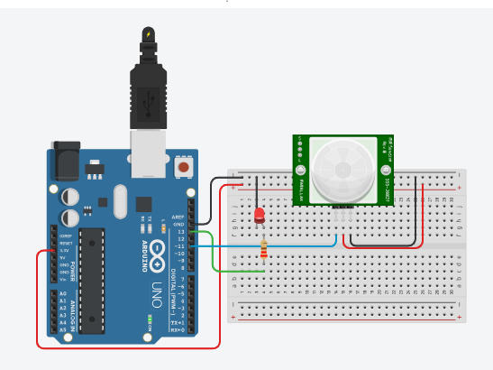

# Detector de movimento e LED
 Neste experimento um LED na porta 13 será controlado pelo botão na porta digital 12. Ao pressionar o botão uma vez este deve ligar o LED. Ao pressionar novamente o botão este deverá desligar o LED e assim sucessivamente.   

 <b><a href="https://www.tinkercad.com/things/dTfAeEiCOOd">Clique Aqui</a></b> para ver o projeto em Tinkercard.com!
 
## Lista de componentes:

- 1  Arduíno UNO R3
- 1  Um cabo de conexão USB
- 1  Placa de prototipação (Protoboard)
- 1  Detector de movimento (PIR - Passive Infrared Sensor, ou Sensor Infravermelho Passivo)
- 1  LED
- 1  Resistor de 220 Ω ohms
- 7  Jumpers (macho-macho)

## Esquema do projeto

